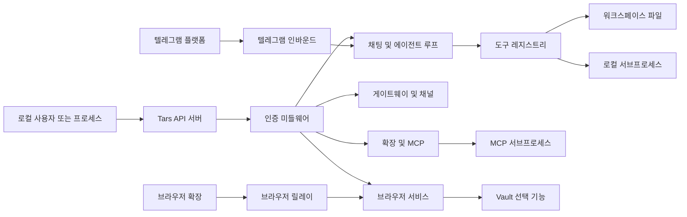

## Executive summary
이 저장소는 강력한 도구 평면(``/v1/chat`` + 에이전트 루프 + ``exec``/파일 도구)을 가진 로컬 우선 AI 자동화 런타임이다. 확인된 운영 맥락(항상 로컬, 개인 저민감 사용)에서 실질적인 최상위 위험은 루프백 API 신뢰를 악용한 로컬 오용, 선택적 채널 활성화 시 프롬프트 기반 도구 악용, 그리고 워크스페이스/호스트의 무결성·가용성 저하다. 인터넷 기원 원격 위협은 대부분 배포 조건이 바뀔 때(비루프백 노출, gateway/channels 활성화, 약한 인증 설정) 현실화된다.

## Scope and assumptions
- 분석 범위(in-scope): ``cmd/tars``, ``internal/tarsserver``, ``internal/serverauth``, ``internal/tool``, ``internal/browserrelay``, ``internal/browser``, ``internal/mcp``, ``internal/plugin``, ``internal/session``, ``internal/memory``, ``internal/config``, ``config/``.
- 분석 제외(out-of-scope): 테스트 전용 동작(``*_test.go``), 개발 문서, 보안 분리 관점 확인 외 CI 파이프라인 내부(``.github/workflows/ci.yml``).
- 사용자 확인 맥락: API는 항상 로컬 전용이며, 데이터 민감도는 개인/저민감이다.
- 가정: 실제 실행도 ``tars serve`` 기본 바인드(``127.0.0.1:43180``)를 사용하며 공개 인바운드가 없다.
- 가정: 토큰 정책(``API_USER_TOKEN``/``API_ADMIN_TOKEN``)은 현재 미확정이며 환경별로 다를 수 있다.
- 가정: 고위험 선택 기능(gateway/channels/telegram/browser/vault/mcp)은 전면 활성화가 아니라 선택적으로만 활성화된다.

위험 등급에 큰 영향을 주는 미해결 질문:
- 활성 환경 전체에서 user/admin 토큰이 항상 설정되는가, 아니면 로컬 루프백 신뢰에 의존하는가?
- 루프백 전용 서비스를 외부로 노출할 수 있는 reverse proxy, SSH 터널, 컨테이너 포트 publish, 원격 포워딩을 사용하는가?

## System model
### Primary components
- ``tars`` 바이너리는 서버 모드(``tars serve``)에서 config/env를 로드하고 워크스페이스를 초기화한 뒤 HTTP API를 제공한다. 근거: ``cmd/tars/server_main.go``, ``internal/tarsserver/main.go``, ``internal/tarsserver/main_bootstrap.go``.
- API 서버는 ``/v1/*`` 아래에 chat, sessions, gateway, channels, browser, extensions, events 핸들러를 조합한다. 근거: ``internal/tarsserver/main_serve_api.go``.
- AuthN/AuthZ는 ``api_auth_mode`` 기반 미들웨어와 role 토큰, admin path 보호로 강제된다. 근거: ``internal/tarsserver/middleware.go``, ``internal/serverauth/middleware.go``.
- Chat 경로는 LLM 에이전트 루프를 실행하며 file read/write/edit, glob/list, shell ``exec``를 포함한 도구 레지스트리를 노출한다. 근거: ``internal/tarsserver/handler_chat_pipeline.go``, ``internal/tarsserver/helpers_agent.go``, ``internal/tool/exec.go``.
- Browser relay는 ``/extension`` 및 ``/cdp``에 대해 token/origin 검사를 수행하는 별도 루프백 서비스다. 근거: ``internal/browserrelay/server.go``, ``internal/tarsserver/helpers_build_browser.go``.
- 선택적 통합 기능으로 Telegram inbound/polling, Vault 자격증명 조회, MCP 서브프로세스 도구가 있다. 근거: ``internal/tarsserver/telegram_inbound.go``, ``internal/vaultclient/client.go``, ``internal/mcp/client.go``.

### Data flows and trust boundaries
- 로컬 사용자/프로세스 -> API 서버(``/v1/*``); 데이터: 프롬프트, 세션 ID, 관리자 작업; 채널: HTTP 루프백; 보안: ``api_auth_mode``(``off``/``external-required``/``required``), admin-path 검사; 검증: JSON 디코딩 + HTTP method 검사. 근거: ``internal/tarsserver/main_options.go``, ``internal/serverauth/middleware.go``, ``internal/tarsserver/main_serve_api.go``.
- API 서버 -> 인증 미들웨어 -> 핸들러; 데이터: bearer token, role, workspace 바인딩; 채널: 프로세스 내부 미들웨어 체인; 보안: 상수 시간 토큰 비교, admin-path role 강제; 검증: path 매칭 + role 체크. 근거: ``internal/serverauth/middleware.go``, ``internal/tarsserver/middleware.go``.
- ``/v1/chat`` -> 에이전트 루프 -> 도구 레지스트리 -> 워크스페이스/OS; 데이터: 비신뢰 프롬프트 텍스트, 도구 인자, 명령 문자열; 채널: 프로세스 내부 호출 + 파일시스템 + 서브프로세스; 보안: 파일 도구의 workspace 경로 제한, ``exec`` 부분 차단 목록; 검증: JSON schema + 도구별 파싱. 근거: ``internal/tarsserver/handler_chat_pipeline.go``, ``internal/tool/workspace_path.go``, ``internal/tool/exec.go``.
- 선택 채널 인바운드(Telegram/Webhook) -> 런타임 -> 에이전트 도구; 데이터: 외부 메시지 텍스트/미디어 payload; 채널: Telegram API polling 또는 webhook HTTP 경로; 보안: DM 정책/페어링/admin-path 인증; 검증: payload 파싱 + 정책 검사. 근거: ``internal/tarsserver/telegram_inbound.go``, ``internal/tarsserver/handler_gateway.go``, ``internal/tarsserver/middleware.go``.
- API 관리자 -> Extensions/MCP -> 외부 프로세스; 데이터: plugin manifest, MCP command/env/args; 채널: 파일시스템 + 서브프로세스 stdio RPC; 보안: plugin root 경계 내 경로 검사; 검증: manifest 파싱 및 source 필터링. 근거: ``internal/extensions/manager.go``, ``internal/plugin/loader.go``, ``internal/mcp/client.go``.
- 로컬 브라우저 확장/클라이언트 -> Browser Relay(``/extension``, ``/cdp``); 데이터: CDP 프레임, relay token; 채널: WS/HTTP 루프백; 보안: loopback 필수 + relay token + origin allowlist; 검증: token 추출 + origin 와일드카드 매칭. 근거: ``internal/browserrelay/server.go``.
- Browser Service -> Vault(선택); 데이터: secret path 및 자격증명; 채널: Vault API HTTP; 보안: Vault 인증 모드 + secret path prefix allowlist; 검증: mount/version 처리 및 allowlist 강제. 근거: ``internal/browser/service.go``, ``internal/vaultclient/client.go``.

#### Diagram

## Assets and security objectives
| 자산 | 중요한 이유 | 보안 목표 (C/I/A) |
|---|---|---|
| 워크스페이스 파일(``workspace/``, sessions, memory, projects) | 사용자 상태와 에이전트 컨텍스트의 핵심 저장소이며 변조 시 동작/출력이 바뀜 | I, A |
| 로컬 호스트 실행 표면(``exec``, 백그라운드 프로세스 매니저) | 명령 실행으로 호스트 상태 및 지속성 변경 가능 | I, A |
| API 인증 토큰(``API_USER_TOKEN``, ``API_ADMIN_TOKEN``) | 관리자/런타임 제어 작업 접근 통제 | C, I |
| Gateway/channel 영속 데이터(``_shared/gateway``) | 실행/채널 히스토리와 운영 상태 저장 | C, I, A |
| Browser relay token 및 CDP 스트림 | 브라우저 자동화/제어 채널 접근 권한 부여 | C, I |
| Vault 자격증명/비밀값(선택) | 유출 시 로컬 앱 바깥으로 권한 피벗 가능 | C |
| MCP/plugin 설정 및 서브프로세스 명령 정의 | 무결성 훼손 시 런타임에서 실행되는 외부 코드에 영향 | I, A |
| 사용량/감사 관련 로그 및 이벤트 | 오용 탐지와 사고 조사에 필요 | I, A |

## Attacker model
### Capabilities
- 동일 머신의 악성 로컬 프로세스/사용자가 API/relay로 루프백 HTTP 요청을 보낼 수 있다.
- 인증되었거나 승인된 채널 참여자(telegram/channel 기능 활성 시)가 조작된 프롬프트/미디어를 보낼 수 있다.
- 운영자 수준 오설정 공격자가 인증을 약화(``off``, 빈 토큰)하거나 위험 옵션을 활성화할 수 있다.
- plugin/MCP source 디렉터리 쓰기 권한을 가진 공급망 형태 공격자가 로드되는 확장에 영향을 줄 수 있다.

### Non-capabilities
- 인터넷에서 직접 사전인증 없이 접근하는 시나리오는 가정하지 않는다(사용자 확인: 항상 로컬).
- 테넌트 간 격리 파괴 시나리오는 범위 밖이다(워크스페이스 바인딩이 단일 default workspace로 고정).
- 고가치 규제 데이터 대량 유출은 현재 맥락의 핵심 위협이 아니다(사용자 확인: 개인 저민감 데이터).

## Entry points and attack surfaces
| 공격 표면 | 도달 경로 | 신뢰 경계 | 비고 | 근거 (repo path / symbol) |
|---|---|---|---|---|
| ``/v1/chat`` | 로컬 HTTP POST | 로컬 호출자 -> agent/tool 평면 | 영향도가 가장 큰 경로, ``exec`` 및 파일 변경 도구까지 도달 가능 | ``internal/tarsserver/main_serve_api.go`` ``mux.Handle("/v1/chat")``; ``internal/tarsserver/helpers_agent.go`` |
| ``/v1/sessions*`` | 로컬 HTTP | 로컬 호출자 -> session store | transcript 및 메타데이터 파일 읽기/쓰기 | ``internal/tarsserver/handler_session.go`` |
| ``/v1/runtime/extensions/reload`` | 로컬 HTTP admin | 관리자 호출자 -> extension loader | 동적 reload로 skill/plugin/MCP 표면 변화 유발 | ``internal/tarsserver/handler_extensions.go``; ``internal/tarsserver/middleware.go`` |
| ``/v1/gateway/reload`` ``/restart`` | 로컬 HTTP admin | 관리자 호출자 -> gateway runtime | 제어 평면 변이/재시작 | ``internal/tarsserver/handler_gateway.go``; ``internal/tarsserver/middleware.go`` |
| ``/v1/channels/webhook/inbound/*`` | HTTP POST | 외부 발신자/관리자 호출자 -> channel runtime | 인바운드 텍스트가 런타임 메시지로 유입됨 | ``internal/tarsserver/handler_gateway.go``; ``internal/tarsserver/middleware.go`` |
| Telegram polling/webhook 경로 | Telegram 플랫폼 + HTTP/admin | 외부 채팅 -> agent runtime | 정책에 따라 동일한 chat 도구 평면으로 라우팅 가능 | ``internal/tarsserver/telegram_inbound.go``; ``internal/tarsserver/main_serve_api.go`` |
| Browser relay ``/extension`` ``/cdp`` | 루프백 WS/HTTP | 로컬 클라이언트/확장 -> 브라우저 제어 | token + loopback + origin 검사 필요 | ``internal/browserrelay/server.go`` |
| Browser API ``/v1/browser/*`` | 로컬 HTTP | 로컬 호출자 -> browser runtime | login/check/run 흐름 트리거 가능 | ``internal/tarsserver/handler_browser.go`` |
| MCP 서버 명령 시작 경로 | 런타임 config + reload/startup | 로컬 설정 -> 서브프로세스 실행 | 외부 바이너리가 env/args와 함께 실행됨 | ``internal/mcp/client.go`` |
| 로그인용 Vault 조회 | Browser login 흐름 | 앱 -> Vault | secret 조회 경로가 path allowlist prefix로 제한됨 | ``internal/browser/service.go``; ``internal/vaultclient/client.go`` |

## Top abuse paths
1. 로컬 악성코드/프로세스가 ``POST /v1/chat``에 악성 프롬프트 전송 -> 에이전트가 ``exec`` 호출 -> 워크스페이스/호스트 상태 변경 -> 지속성 확보 또는 파괴 행위.
2. 공격자가 Telegram 페어링 승인 획득(또는 정책이 open으로 오설정) -> 도구 호출 유도 프롬프트 전송 -> 서버 사용자 권한으로 파일 수정/명령 실행.
3. 운영자가 ``TOOLS_WEB_FETCH_ALLOW_PRIVATE_HOSTS=true`` 활성화 -> 프롬프트가 내부 URL fetch 요청 -> 로컬 네트워크 메타데이터/내부 서비스 내용 유출.
4. plugin/MCP source 디렉터리가 침해되어 악성 명령 설정 추가 -> 관리자 reload/startup 시 공격자 제어 서브프로세스 실행 -> 도구 응답이 비신뢰 출력으로 오염.
5. 로컬 공격자가 ``/v1/chat`` 또는 ``/v1/agent/runs``에 고비용 요청을 대량 전송 -> CPU/토큰/프로세스 자원 소모 -> 서비스 저하 및 정상 자동화 지연.
6. 로컬 공격자가 browser relay token 획득(오설정 유출/관리자 노출) -> ``/cdp`` 연결 후 브라우저 세션 제어 -> 무단 자동화 및 세션 오용 가능.

## Threat model table
| Threat ID | 위협 원천 | 전제 조건 | 위협 행위 | 영향 | 영향 자산 | 기존 통제 (근거) | 갭 | 권장 완화책 | 탐지 아이디어 | 발생 가능성 | 영향도 | 우선순위 |
|---|---|---|---|---|---|---|---|---|---|---|---|---|
| TM-001 | 비신뢰 로컬 프로세스/사용자 | API가 루프백에서 접근 가능하고 로컬에 대해 인증 모드가 엄격 토큰 강제가 아니거나(``external-required``) 토큰이 미설정됨 | ``/v1/chat`` 호출로 에이전트의 ``exec``/write/edit 동작 유도 | 호스트/워크스페이스 무결성 훼손 및 로컬 가용성 저하 | 워크스페이스 파일, 호스트 실행 표면 | 기본 loopback bind(``internal/tarsserver/main_options.go``), auth 미들웨어(``internal/serverauth/middleware.go``), workspace 경로 제한(``internal/tool/workspace_path.go``) | ``external-required``가 loopback을 신뢰하며 ``exec`` 차단 목록이 작음(``internal/tool/exec.go``) | ``API_AUTH_MODE=required`` 강제, user/admin 토큰 상시 설정, ``exec``·파괴적 파일쓰기 승인 게이트 추가, Unix domain socket + OS ACL 지원 | ``POST /v1/chat`` 및 ``exec``/``write*`` 도구 이벤트 로깅·알림, 명령 오류 급증 모니터링 | 중간 | 높음 | 높음 |
| TM-002 | 선택 채널을 통한 외부 메시지 발신자 | Telegram/channels 활성화 상태에서 공격자가 인바운드 메시지 전송 가능(정책 open, 페어링 침해 등) | 인바운드 텍스트 프롬프트 인젝션으로 도구 호출 체인 유도 | 로컬 chat 경로와 동일한 영향이 외부 메시징 채널에서도 발생 | 워크스페이스 파일, 호스트 실행 표면, 채널 상태 | DM 정책/페어링 검사(``internal/tarsserver/telegram_inbound.go``), webhook endpoint admin 보호(``internal/tarsserver/middleware.go``) | 발신자 승인 후 채널별 강한 도구 제한 프로필이 없음 | 채널별 도구 allowlist 적용(기본 읽기 전용), ``exec`` 명시 승인 요구, Telegram 세션을 제한된 project/tools 집합으로 격리 | 인바운드 채널 이벤트 직후 고위험 도구 호출 연계 모니터링, 신규 발신자의 특권 도구 사용 알림 | 중간 | 높음 | 높음 |
| TM-003 | 오설정 + 악의적 프롬프트 사용자 | ``web_fetch`` 활성화 + private host 허용 옵션 켜짐 | ``web_fetch``로 내부/사설 호스트 접근 후 응답 중계 | 내부망 데이터 노출 및 피벗 단서 제공 | 로컬 네트워크 메타데이터, 내부 서비스 데이터 | 기본적으로 private host 차단 SSRF 가드(``internal/tool/web_fetch.go``) | 설정/env로 차단이 비활성화 가능(``internal/config/env.go``) | 정책상 private-host fetch 비활성 유지, 런타임 불변 설정 적용, 필요한 호스트만 명시 allowlist | RFC1918/loopback hostname fetch 알림, 최종 URL 및 호출 role/source 기록 | 낮음 | 중간 | 중간 |
| TM-004 | 악성 로컬 파일/설정 변경자(공급망) | plugin/MCP 디렉터리 또는 config 쓰기 권한 + reload/startup 수행 | 악성 plugin/MCP 서버 명령 주입 후 런타임에서 실행 | 확장 생태계를 통한 임의 서브프로세스 실행 | MCP/plugin 무결성, 호스트 실행 표면 | plugin skill-path escape 검사(``internal/plugin/loader.go``), source 정규화(``internal/extensions/manager.go``) | plugin manifest/MCP 명령 신뢰 검증(서명/허용목록) 부재 | 신뢰 plugin dir 읽기전용 고정, 서명된 manifest 도입, MCP 실행 명령 allowlist/denylist 도입 | extension reload diff, 신규 MCP 명령 값, 비정상 프로세스 트리 감지 | 중간 | 중간 | 중간 |
| TM-005 | 로컬 호출자 오남용 | API 접근 권한 + run/chat endpoint 스팸 가능 | 고비용 run/prompt를 대량 전송해 CPU/토큰/프로세스 소진 | 서비스 지연 및 자동화 기아 | 가용성 핵심 런타임 구성요소 | 반복 횟수 제한(``internal/config/types.go`` ``AgentMaxIterations``), 명령 timeout(``internal/tool/exec.go``), 사용량 추적(``internal/tarsserver/main_bootstrap.go``) | 호출자 단위 명시적 API rate limiting/동시성 quota 부재 | endpoint별 rate limit/동시 run cap 도입, 큐 backpressure, 과부하 시 안전 거절 응답 | 요청률, run 큐 깊이, timeout 비율, 장기 실행 명령 반복 패턴 추적 | 중간 | 중간 | 중간 |
| TM-006 | 로컬 relay 클라이언트 공격자 | 로컬 접근 + relay token 노출/추측 기회 | ``/cdp`` 연결 후 browser relay 세션 제어 | 무단 브라우저 동작, 세션 오용 가능 | browser relay 채널, 브라우저 세션 무결성 | loopback 필수 + token 필수 + origin allowlist(``internal/browserrelay/server.go``) | token 미설정 시 시간 기반 문자열 fallback, query string으로 token 전달 가능 | token을 항상 암호학적 난수로 생성, header 기반 token 전달 우선, restart/reload 시 token 회전 | relay 인증 실패 급증 및 예기치 않은 추가 CDP 클라이언트 알림 | 낮음 | 중간 | 낮음 |

## Criticality calibration
이 저장소/맥락(로컬 전용, 개인 저민감)에서는 대규모 데이터 유출보다 호스트 무결성과 운영 영향 중심으로 우선순위를 정한다.

- ``critical``: 최소 전제 조건으로 비로컬/사전인증 경로에서 즉시 호스트 장악 또는 특권 제어가 가능한 경우.  
예: 원격 노출된 API에서 auth bypass로 ``exec`` 가능, 비루프백에서 relay token 우회로 임의 browser/CDP 제어, vault allowlist 우회로 광범위 자격증명 노출.
- ``high``: 일반 로컬 워크플로에서 재현 가능한 실행/변조 경로로 호스트·워크스페이스 상태를 크게 바꿀 수 있는 경우.  
예: ``exec`` 유도 루프백 API 오용(TM-001), 승인 후 외부 채널 프롬프트의 고위험 도구 경로(TM-002), 인증된 관리자 오용으로 악성 확장 payload 로드.
- ``medium``: 의미 있는 무결성/가용성 위험이지만 오설정 또는 지속적 남용을 요구하는 경우.  
예: private-host fetch 활성화 오용(TM-003), 로컬 plugin/MCP 공급망 변조(TM-004), 요청 폭주 DoS(TM-005).
- ``low``: 전제 조건이 까다롭거나 영향 반경이 제한적이고 잡음이 큰 경우.  
예: 강한 loopback 통제 하 relay token 오용(TM-006), 추가 권한 없이 정보성 endpoint(``/v1/healthz``, ``/v1/auth/whoami``) 노출.

## Focus paths for security review
| 경로 | 중요한 이유 | 관련 Threat ID |
|---|---|---|
| ``internal/serverauth/middleware.go`` | 인증 모드 의미론과 loopback 신뢰 결정의 중심 | TM-001, TM-002 |
| ``internal/tarsserver/middleware.go`` | 민감 라우트의 admin-path 보호 매핑 | TM-001, TM-002 |
| ``internal/tarsserver/main_serve_api.go`` | 전체 런타임 라우트 표면 및 기능 결선 지점 | TM-001, TM-002, TM-005 |
| ``internal/tarsserver/handler_chat_pipeline.go`` | chat에서 도구 실행으로 이어지는 핵심 브리지, 기본 schema 주입 동작 | TM-001, TM-002, TM-005 |
| ``internal/tarsserver/helpers_agent.go`` | 기본 도구 등록 시 ``exec`` 및 파일 변경 도구 포함 | TM-001, TM-002 |
| ``internal/tool/exec.go`` | 명령 실행 정책, timeout, 차단 목록 정의 | TM-001, TM-005 |
| ``internal/tool/workspace_path.go`` | 파일 경로 제한 및 symlink escape 방지 로직 | TM-001, TM-002 |
| ``internal/tool/web_fetch.go`` | SSRF 가드와 private-host 우회 스위치 | TM-003 |
| ``internal/tarsserver/telegram_inbound.go`` | 외부 메시지가 동일한 agent 도구 평면으로 유입되는 지점 | TM-002 |
| ``internal/tarsserver/handler_gateway.go`` | webhook/channel 인바운드와 메시지 라우팅 | TM-002, TM-005 |
| ``internal/browserrelay/server.go`` | relay 인증/origin 로직 및 token 처리 | TM-006 |
| ``internal/mcp/client.go`` | MCP 서버 실행 시 외부 명령 실행 경로 | TM-004 |
| ``internal/plugin/loader.go`` | plugin 경로 신뢰 경계 및 traversal 통제 | TM-004 |
| ``internal/extensions/manager.go`` | hot-reload 동작과 런타임 공격 표면 확장 지점 | TM-004 |
| ``internal/vaultclient/client.go`` | Vault secret-path allowlist 강제 및 자격증명 접근 모델 | TM-003 |
